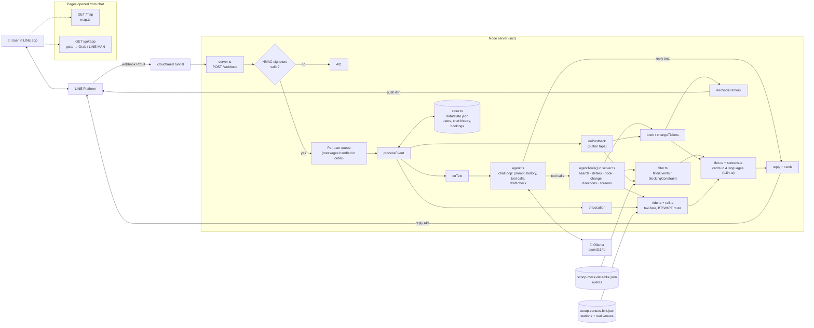
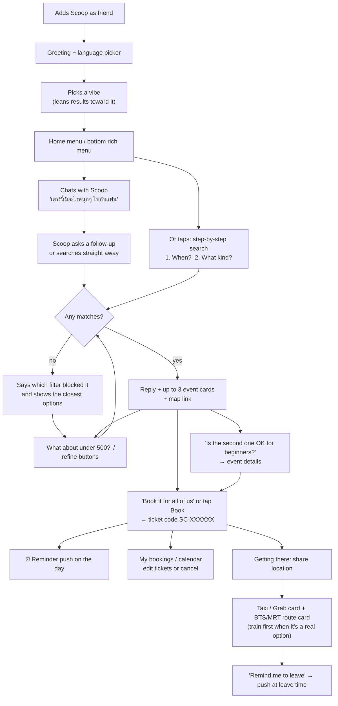
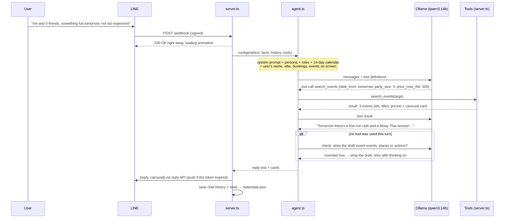

# Scoop

A LINE bot that finds, books and gets you to Bangkok events from `scoop-mock-data-bkk.json`.
Thai, English, Chinese and Hindi.

## Quick start (no coding needed)

Scoop runs **on your own Mac**. While it is running, anyone who messages the bot in LINE gets answers. When the Mac is off, asleep or Scoop is stopped, the bot stays silent.

You type a few short commands into **Terminal**. Copy each grey line exactly, paste it into Terminal, and press **Enter**.

### Before you start

- **A Mac:** Apple Silicon (M1 or newer) with at least **16 GB of memory**, and about **15 GB of free disk space** for the AI model.
- **Internet:** needed the whole time the bot runs.
- **LINE Developers access:** the project's **Messaging API channel** at [https://developers.line.biz/console/](https://developers.line.biz/console/). Ask the group member who created it to add you, or create your own (see "One-time LINE settings" below).

### Step 1 — Open Terminal in the project folder

1. Open **Finder** and find the `scoop-project` folder.
2. Open **Terminal** (press `⌘ Space`, type `Terminal`, press Enter).
3. Type `cd ` (with a space after it), drag the `scoop-project` folder from Finder into the Terminal window, then press **Enter**.

Do this step every time you open a new Terminal window.

### Step 2 — Set up (first time only)

    make setup

This installs the missing tools and the bot's packages. It asks you to paste two LINE keys, which it saves in a private file called `.env`. It then downloads the AI model (about 9 GB, so 10–30 minutes the first time). When it says **Setup done**, move on.

- **If it says Homebrew is missing:** go to [https://brew.sh](https://brew.sh), copy the command shown there into Terminal, press Enter, type your Mac password when asked (nothing appears while you type, that's normal), then run `make setup` again.
- **If a window asks to install "command line developer tools":** click **Install**, wait for it to finish, then run `make setup` again.

Where to find the two LINE keys (LINE Developers console → your channel):

| Key                  | Where                                                                            |
| -------------------- | -------------------------------------------------------------------------------- |
| Channel secret       | **Basic settings** tab                                                     |
| Channel access token | **Messaging API** tab, at the bottom (press **Issue** if it's empty) |

### Step 3 — Start Scoop

    make start

It starts the AI model, the bot and a public link, then tells LINE to use that link. You're done when you see **Scoop is running**. Send the bot a message in LINE to try it.

- **Keep the Mac plugged in with the lid open.** Scoop stops the Mac from going to sleep on its own, but closing the lid still puts it to sleep.
- **You can close the Terminal window;** Scoop keeps running.
- **The first reply can take up to a minute** while the AI model loads. After that, replies take about 10–15 seconds.

### Step 4 — Stop Scoop

    make stop

### Other commands

| Command          | What it does                                                         |
| ---------------- | -------------------------------------------------------------------- |
| `make status`  | Is Scoop running? Is LINE connected to it?                           |
| `make restart` | Stop and start again. Use this if the bot stops answering            |
| `make logs`    | Watch what the bot is doing (press`Ctrl C` to leave)               |
| `make chat`    | Chat with Scoop right in Terminal, without LINE — handy for testing |
| `make menu`    | Upload the bottom menu to LINE (do this once)                        |
| `make test`    | Run the automatic checks                                             |
| `make reset`   | Delete all users and bookings (asks first, keeps a backup)           |

If `make` doesn't work on a Mac, use `./scripts/local.sh` followed by the same word instead, for example `./scripts/local.sh start`.

### One-time LINE settings

In the LINE Developers console, on your channel's **Messaging API** tab:

1. Turn **Use webhook** on.
2. Next to "Auto-reply messages", click **Edit**. In the LINE Official Account Manager page that opens, turn **Auto-response off** and **Webhooks on**. Otherwise LINE sends its own canned replies as well.
3. Scan the **QR code** on the same tab with your phone to add the bot as a friend.
4. After your first `make start`, run `make menu` once to add the bottom menu.

You don't need to paste the webhook URL yourself: `make start` sets it every time. If LINE rejects it, `make start` prints the link and it's already copied, so paste it into **Webhook URL → Edit → Update → Verify**.

### When something goes wrong

| What you see                                                  | What to do                                                                                                                                                                 |
| ------------------------------------------------------------- | -------------------------------------------------------------------------------------------------------------------------------------------------------------------------- |
| The bot doesn't answer in LINE                                | Run`make status`. If anything is not running, or LINE points at a different link, run `make restart`                                                                   |
| "Port 3000 is already used"                                   | Scoop is already running in another window. Run`make stop`, then `make start`                                                                                          |
| "LINE keys are missing" or "LINE did not accept the new link" | The keys in`.env` are wrong or were reissued. Open `.env` in TextEdit, fix the two LINE lines, save, then `make restart`                                             |
| "Could not create the public link"                            | Check the Wi-Fi, then`make start` again                                                                                                                                  |
| Replies are very slow                                         | Close other big apps. On a 16 GB Mac, open`.env`, change `OLLAMA_MODEL=qwen3:14b` to `OLLAMA_MODEL=qwen3:8b`, then `make restart` (faster but makes more mistakes) |
| Anything else                                                 | Run`make logs`, and send the last lines to whoever maintains the code                                                                                                    |

The public link changes every time Scoop starts. `make start` updates LINE for you, so there's nothing to copy, but an old link won't work anymore.

## How it works

Scoop is one Node server with no database and no build step. LINE sends every chat event to `/webhook`. Users and bookings are saved to `data/state.json`.

**Typed messages go to an AI agent.** A local LLM (`qwen3:14b` on Ollama) holds the conversation in the user's language. It remembers the last few messages, knows the user's bookings and the events on screen, and decides when to act. To act, it calls tools, and the tools are Scoop's own code:

| Tool               | What it does                                                                                                               |
| ------------------ | -------------------------------------------------------------------------------------------------------------------------- |
| `search_events`  | Filters the events. If nothing matches, it says which filter blocked it and returns the closest events without that filter |
| `event_details`  | Description, times, price, venue, phone, how to get there                                                                  |
| `book_event`     | Books tickets and returns the ticket card                                                                                  |
| `change_booking` | Changes the ticket count, or cancels                                                                                       |
| `get_directions` | Taxi / Grab fare and BTS/MRT route, after asking for the user's location                                                   |
| `show_screen`    | Home menu, bookings, calendar, profile, language or vibe picker                                                            |

The model only chooses and phrases; it never has the final say on facts. Events, prices, seats and booking codes come from the tools. Tool results that are shown to the user appear as LINE cards under the model's reply. It can only book an event the user has actually been shown. When a reply used no tools, a second short model call checks the draft for invented events, places, routes or claimed actions. A flagged draft is never sent: the model tries again with thinking turned on, and if the retry is also flagged, the user gets a "sorry" message instead.

**Taps don't use the model.** The step-by-step search, refine buttons, bookings, edit/cancel and the bottom menu are plain code and respond instantly.

### Architecture

### What a user does

### One typed message, step by step

### The data files

- `scoop-mock-data-bkk.json`: the 500 events being searched and booked (mock, 13 Sep – 4 Oct 2026). Events `e30` onwards are placed at real venues (`venue.venue_id`, `venue.google_maps_url`). Titles, times, prices and seats are invented.
- `assets/events/eXX.jpg`: one photo per event from Wikimedia Commons (CC BY / CC BY-SA / CC0 / public domain), resized to 640 px. Cards load them from the bot's own `/assets` URL, because Wikimedia refuses requests without a User-Agent. Each event's `image_credit` and `image_source` name the author and licence.
- `scoop-venues-bkk.json`: the station list that `rail.ts` plans routes on, plus 332 real venues from OpenStreetMap. It is built by `scripts/venues/1-fetch-osm.mjs` (Overpass queries per category) and then `2-rank.mjs` (nearest station, walk time, scored by phone/website/Wikidata/bilingual name).
- `data/state.json`: users (language, vibe, recent chat, events on screen, last filter) and bookings. On startup the server takes booked seats back off the events and re-arms reminders that haven't fired.

### Choosing the model

Tested on an M2 Max (32 GB) with the same scripted conversations in Thai, English and Chinese:

| Model                   | Per reply   | Behaviour                                                                                                                                   |
| ----------------------- | ----------- | ------------------------------------------------------------------------------------------------------------------------------------------- |
| `qwen3:14b` (default) | ~10–15 s   | Searches when it should, uses the right event ids, books and cancels through the tools. Its occasional slips get caught by the draft check. |
| `qwen3:8b`            | ~4–6 s     | Often chats without searching, invents events and routes, and the draft check (also run by the 8B) misses some of them.                     |
| `OLLAMA_THINK=1`      | ~3× slower | More careful on every reply. Without it, thinking is used only to retry a dropped draft.                                                    |

The model needs about 10 GB of memory. On a smaller machine, use `qwen3:8b` and expect more mistakes.

## Run by hand (for developers)

`make start` does all of this for you (see Quick start). The manual steps are:

    npm install
    brew install ollama && ollama pull qwen3:14b
    ollama serve                 # keep running in its own terminal
    cp .env.example .env         # fill in the two LINE keys
    npm test                     # filter tests + agent loop tests (fake model, no Ollama needed)
    npm run try                  # chat with Scoop in the terminal, no LINE needed (nothing is saved)
    npm run try -- "หาอะไรทำเสาร์นี้ งบไม่เกิน 500"   # one message
    npm start                    # server on :3000
    cloudflared tunnel --url http://localhost:3000   # paste <url></url>/webhook into the LINE console
    npm run richmenu             # once: registers the fixed bottom menu

Needs Node 22.18+ (runs the .ts files directly, no build step).

## Run with Docker

Starts the bot and the Cloudflare tunnel together. The only things needed on the machine are Docker Desktop and Ollama.

    brew install ollama && ollama pull qwen3:14b
    ollama serve                              # on the Mac itself: uses the GPU, much faster than inside Docker
    cp .env.example .env                      # fill in the two LINE keys
    docker compose up --build -d              # bot on :3000 + tunnel
    docker compose logs tunnel | grep trycloudflare   # paste <url></url>/webhook into the LINE console
    docker compose logs -f scoop              # watch the bot

Other commands:

    docker compose run --rm scoop npm test
    docker compose run --rm scoop node src/server.ts --try "หาอะไรทำเสาร์นี้ งบไม่เกิน 500"
    docker compose run --rm scoop node scripts/richmenu.ts
    docker compose down                       # stop everything; data/state.json is kept

To run Ollama in Docker too, add `OLLAMA_URL=http://ollama:11434` to `.env`, then run `docker compose --profile ollama up --build -d`. Nothing needs installing, but on a Mac it runs on the CPU only, so a 14B model is too slow for chat. The first start downloads the model (~9 GB), and Docker Desktop needs at least 12 GB of memory.

The tunnel URL changes whenever the tunnel container restarts. Put the new one into the LINE console each time.

## Files

- `src/server.ts` — webhook, signature check, the agent's tools, every button action (menu, step-by-step search, booking, edit/cancel, calendar, profile, ride), terminal chat
- `src/agent.ts` — the chat agent: system prompt, tool definitions, Ollama tool-calling loop, draft check
- `src/dates.ts` — date windows for searches ("this weekend", day ranges, never in the past)
- `src/filter.ts` — pure filter + "which constraint blocked it"
- `src/flex.ts` — result cards, ticket, ride card, onboarding messages
- `src/screens.ts` — home menu, step-by-step search, my bookings, calendar, profile
- `src/i18n.ts` — all user-facing text in four languages
- `src/store.ts` — users and bookings, saved to `data/state.json`
- `src/ride.ts` — taxi distance, fare and leave-time estimates
- `src/rail.ts` — BTS / MRT / ARL / Gold Line route planner: walk, lines, changes, stops, time and fare estimate
- `src/map.ts` — the map page opened from the chat
- `src/go.ts` — page that hands off to the Grab / LINE MAN app (opens in the phone's browser)
- `scripts/richmenu.*` — bottom menu image and the script that registers it
- `scripts/venues/` — fetch and rank real venues from OpenStreetMap into `scoop-venues-bkk.json`
- `assets/greeting.jpg` — optional image sent with the greeting (served at /assets)
- `scoop-venues-bkk.json` — 332 real venues near BTS/MRT stations, with phone, nearest station and a Google Maps search link (© OpenStreetMap, ODbL)
- `assets/events/` — one photo per event (Wikimedia Commons, credits in each event's `image_credit`)
- `test/filter.test.ts` — runs the `eval_set` from the JSON
- `test/agent.test.ts` — the agent loop against a fake Ollama: tool calls, cards, errors, round limit, dropped drafts, calendar
- `Makefile`, `scripts/local.sh` — `make setup / start / stop / status …` for running on a Mac (see Quick start); runtime files go in `.run/` and `logs/`
- `Dockerfile`, `docker-compose.yml` — container setup (see Run with Docker)

## Demo-day switches

- Reminders go out on the event day (08:00, or 20:00 the evening before for events starting before 10:00). `REMINDER_DEMO_SECONDS=60` makes them fire a minute after booking instead, for a live demo.
- `DEMO_NOW` — the mock events run 13 Sep – 4 Oct 2026. Set this if you demo on another date.
- `REPLY_MODE=text` — if Flex breaks, restart with this and you get the same events as plain text.
- Delete `data/state.json` (with the server stopped) to start with no users or bookings.
